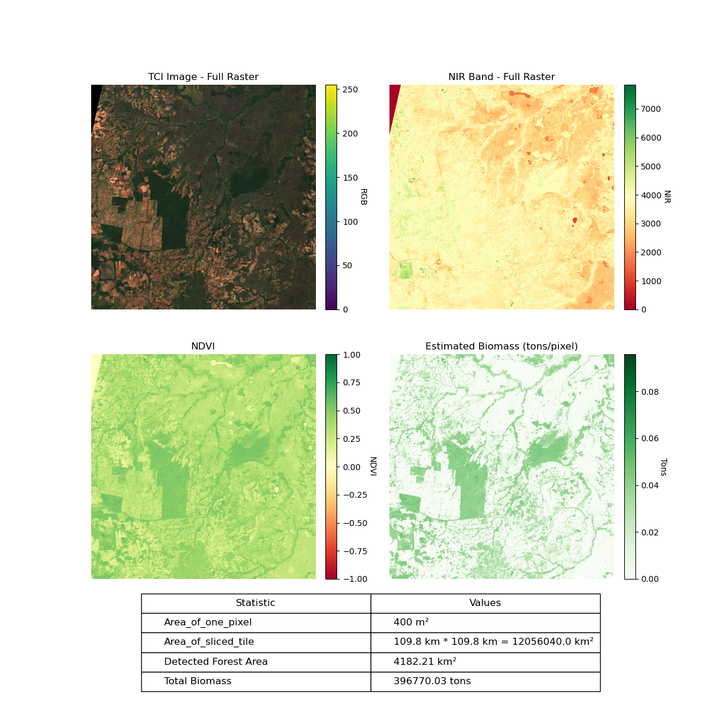
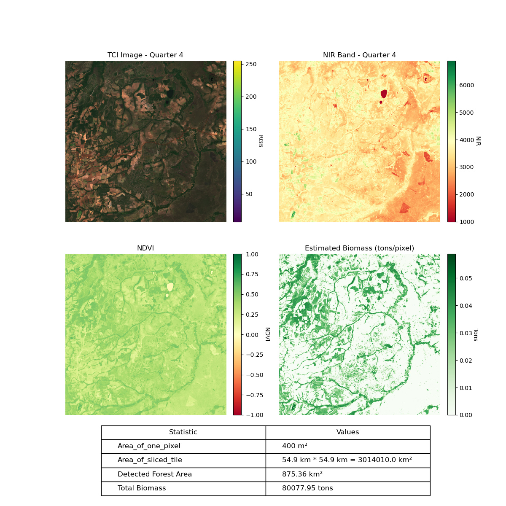

# Description #

This project provides ***Biomass estimation*** using NVDI calculation from MS images. 
The required images are uploaded in Google Drive and  will be automatically downloaded by the script.


* Data Source: Sentinel-2 multispectral satellite imagery covering a some forest region in Brazil. 
  The image has a resolution of 5490 × 5490 pixels at 20m per pixel, covering approximately 109.8 × 109.8 km².

* Spectral Band Selection: Selected the Red and NIR (Near-Infrared) bands from the multispectral image for forest analysis.

* Image Slicing: The entire satellite image is divided into smaller tiles or quarters to enable localized biomass analysis and reduce memory load during processing.

* NDVI Computation: Calculated the Normalized Difference Vegetation Index (NDVI) to evaluate forest health and greenness:

* The Biomass is then estimated by using a next few steps.

(1) Calculate area of one pixel using spatial resolution:

    Area/pixel (m²/pixel) = pixel_size_x * pixel_size_y 

(2) Derive biomass density by using the following equations:

    Biomass Density (tons/ha)= m * NDVI + c 

    where, m and c are the coefficients come from field calibration. 

(3) Total Biomass in tons is finally calculated by multiplying it (tons/ha) with the pixel area in hectares (ha/pixel) over the mask (the pixel location of exsiting forest).


## The estimated Biomass output for the entire satellite image is 

<div align="center">

</div>


## The estimated Biomass output for sliced image Quarter4 is
<div align="center">

</div>


## Create and activate conda environment

* conda create --name biomass_env python=3.8 

* conda activate biomass_env

* pip install -r requirements.txt


## Run Command Line 

### For running entire image

```python BioMass_Test.py --tci Testimages/T22LDN_20240628T133839_TCI_20m.jp2  --red Testimages/T22LDN_20240628T133839_B04_20m.jp2 --nir Testimages/T22LDN_20240628T133839_B8A_20m.jp2 --quarter 0 --save-img tester0.png```

### For running slice image (quarter_no = 1 ~ 4)

```python BioMass_Test.py --tci Testimages/T22LDN_20240628T133839_TCI_20m.jp2  --red Testimages/T22LDN_20240628T133839_B04_20m.jp2 --nir Testimages/T22LDN_20240628T133839_B8A_20m.jp2 --quarter {quarter_no} --save-img {resultname.png}```


